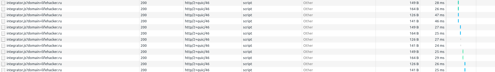
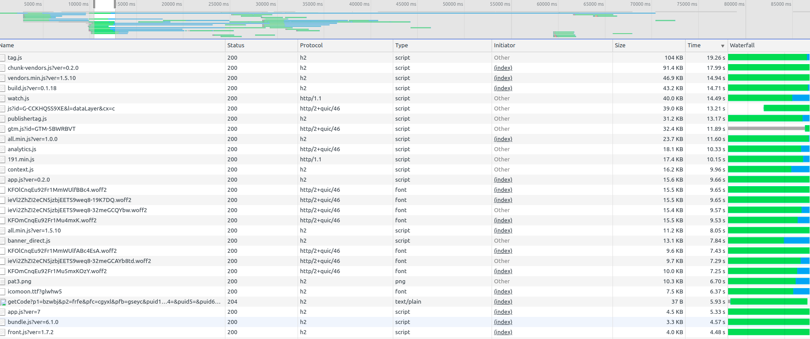

## Основное задание

1. #### Network
  - HAR архив в репе
   - дублирование ресурсов
   В основном тут запросы на показ контекстной рекламы, но они подгружают каждый раз одно и тоже.
    
    
    
    

  - медленно загружающиеся ресурсы
  Картинки которые не пережаты, большие либы со скриптами.
  

  - ресурсы, блокирующие загрузку
  Здесь просто куча css и JS файлов.
    
   - Лишний размер ресурса
   Самый большой размер у картинок, которые не пережаты.
   

   - Еще подгружаются старые версии скриптов, вместе с новыми. В которых код дублируется, но не полностью.

2. #### Performance 
 - First Paint: 928ms
 - First Meaningful Paint: 1611ms
 - DOM Content Loaded: 2490ms
 - Load: 5314ms

- Loading, Scripting, Rendering, Painting
 

3. #### Coverage
- Вкладка после загрузки

- Объём неиспользованного CSS: ~380кб

- Объём неиспользованного JS: ~ 1360кб

## Бонусное задание

1. #### Network
  - HAR архив в репе
   - дублирование ресурсов
   Не изменилось
    

  - медленно загружающиеся ресурсы
  Те же самые ресурсы, только время увеличилось. Но некоторые так и не загрузились, например тот запрос который долго висел в первом случае. И оставался со status code 303
  

  - ресурсы, блокирующие загрузку
  Здесь просто куча css и JS файлов.
    
    

   - Лишний размер ресурса
   Те же картинки, котоыре не пережаты. И js, с картинками ситуация ожидамое ухудшилась.
   

   - Часть ресурсов googlesyndication просто не догрузились, не дождавшись таймаута видимо. И дргуие похожие ресурсы контекстной рекламы тоже рипнулись.

   2. #### Performance 
 - First Paint: 10182ms
 - First Meaningful Paint: 13431ms
 - DOM Content Loaded: 27525ms
 - Load: 68925ms

- Loading, Scripting, Rendering, Painting
 

 3. #### Coverage
- Вкладка после загрузки

Объем +- такой же

- Объём неиспользованного CSS: ~380кб

- Объём неиспользованного JS: ~ 1360кб